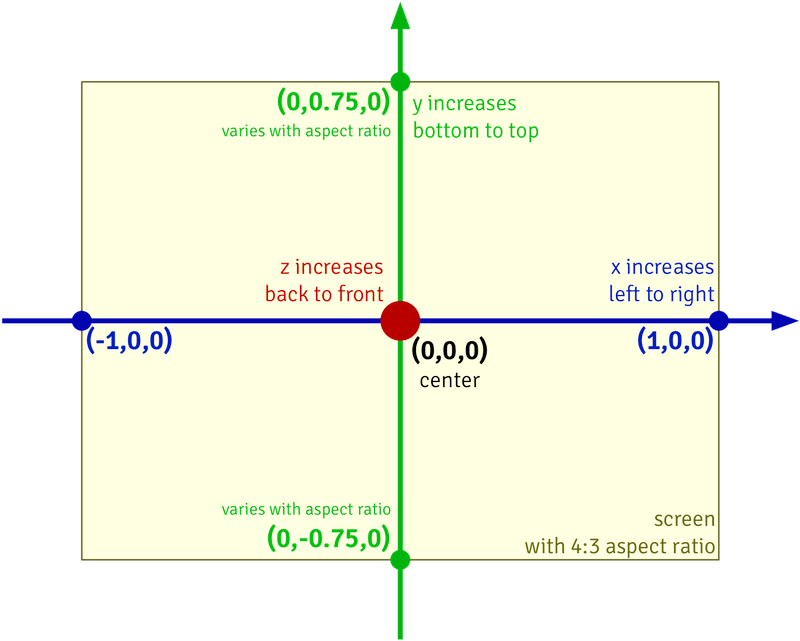

These nodes are for capturing input from a mouse or touchpad. 

The composition must have at least one window for these nodes to output any mouse information. 

These nodes can track mouse movements, button actions, and scrolling. For mouse movements and button actions, they can output mouse positions and deltas (changes in position) either relative to the screen or relative to a graphics window. 

If you leave the `Window` input port of the mouse node unconnected, then it will output mouse positions and deltas in screen coordinates. If you have a single screen, its top left corner is at the point (0,0), and its bottom right corner matches the resolution (width and height) of the screen in points. For example, 1440x900 display would have bottom right coordinate (1440,900).

If you connect the `Window` output port of a graphics window node (such as `Render Scene to Window`) to the `Window` input port of one of the mouse nodes, then the mouse node will only output mouse movements and button actions when that window is the active (frontmost) window. It will output mouse positions and deltas in Vuo coordinates, relative to the graphics area of the window. 

